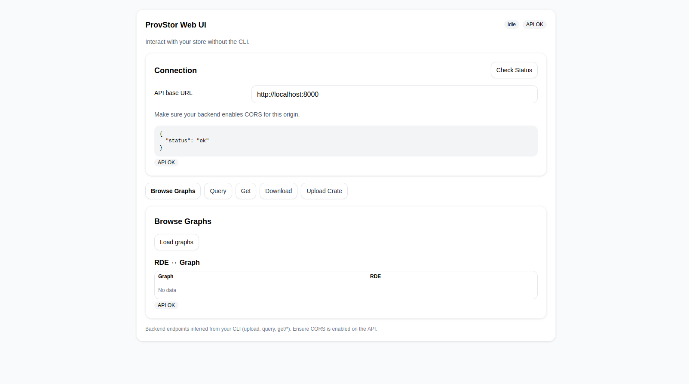

# Provenance Storage UI

A modular React + TypeScript frontend for exploring, querying, and downloading data from a Provenance Storage backend.

## Screenshots


*Main dashboard showing all feature panels*


## Features

- Modular UI with feature panels: Upload, Query, Browse, Get, Download, and Status
- Per-item download buttons in Browse tab
- Execute SPARQL queries directly without needing to upload a file
- Always-visible status and toast notifications

## Getting Started

### Prerequisites
- Node.js (v18+ recommended)
- npm
- Provenance Storage backend

### Installation
```bash
cd provenance-storage-ui
npm install
```

### Running the App
```bash
npm run dev
```
The app will be available at `http://localhost:5173` (default Vite port).

### Building for Production
```bash
npm run build
```

## Project Structure

- `src/`
  - `App.tsx`: Main entry point
  - `ProvStorUI.tsx`: Main container, orchestrates feature panels
  - `components/`
    - `UI/`: Shared UI elements (Button, Section, Pill, etc.)
    - `StatusPanel/`: Status notifications and API health
    - `UploadPanel/`: File upload interface
    - `QueryPanel/`: Query builder and results
    - `BrowsePanel/`: Data browsing and per-item downloads
    - `GetPanel/`: Retrieve specific items
    - `DownloadPanel/`: Bulk download functionality
  - `utils/`: API helpers and configuration


## CORS Configuration

**Important**: To allow the frontend to communicate with the API, you must configure CORS origins in your `.env` file:

```bash
# For instance, during the development allow this
CORS_ALLOWED_ORIGINS=http://localhost:5173
```

Note: Using `*` allows all origins for development purposes. For production, specify the exact origins (e.g., `http://localhost:5173,https://yourdomain.com`).
